# LUNA CRUENTA

<p align="center">
  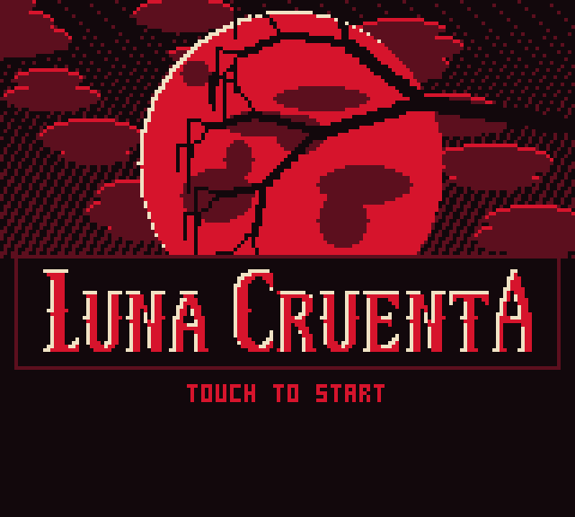
</p>

<p align="center"><b>한국어</b> &nbsp;·&nbsp; <a href="#english">English ↓</a></p>

**4색으로 그린 고어 아케이드 게임. HTML 파일 하나, 9,999바이트.**
[10 Kilobytes Jam](https://itch.io/jam/10-kilobytes-jam-) 출품작입니다.

당신은 가시 박힌 쇠공에 사슬로 묶여 있습니다. 휘두르세요. 흘린 것은 전부 바닥에 남습니다.

이미지 파일도, 폰트 파일도, 오디오 파일도, 라이브러리도 없습니다. 스프라이트, 보스 둘, 폰트 둘, 타이틀 화면, 엔딩, 음악, 효과음이 전부 그 파일 하나에 들어 있습니다.

## 플레이

[`luna-cruenta.html`](luna-cruenta.html)을 내려받아 브라우저로 열면 됩니다. 다른 건 필요 없습니다.

<!-- TODO: 업로드 후 itch.io 페이지 링크를 여기에 추가 -->

- **마우스:** 캐릭터가 포인터를 따라 달립니다.
- **터치:** 화면 아무 데나 대고 끕니다. 목표 지점이 손가락보다 1.5배 멀리 움직여서, 손이 캐릭터를 가리지 않습니다.
- 키보드도 버튼도 없습니다. 클릭이나 탭 한 번으로 시작하고, 강화 카드를 고르고, 다시 시작합니다.

브라우저는 첫 클릭이나 탭 전에는 소리를 내지 않습니다. 타이틀 화면이 조용하다면 첫 터치는 음악만 켜고, 두 번째 터치에 게임이 시작됩니다.

## 스크린샷

<p align="center">
  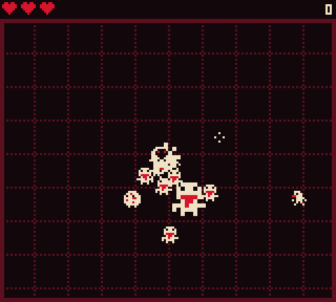
</p>

| | | |
|:-:|:-:|:-:|
| 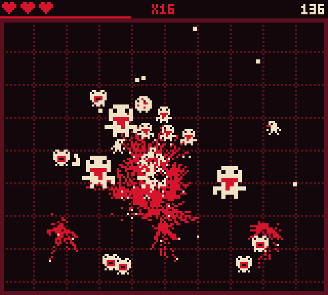 | 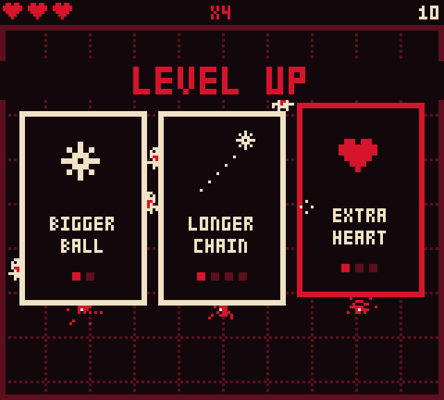 | 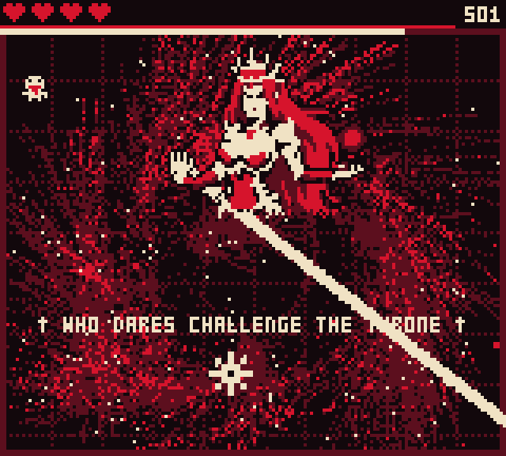 |
| 모든 종류의 망자가 한꺼번에 | 레벨 업: 카드 한 장 선택 | 진홍의 여왕의 빔 |
| 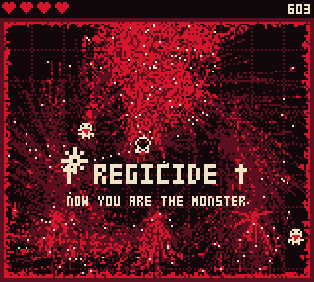 | 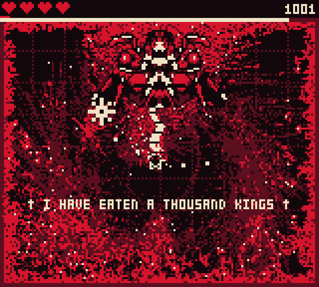 | 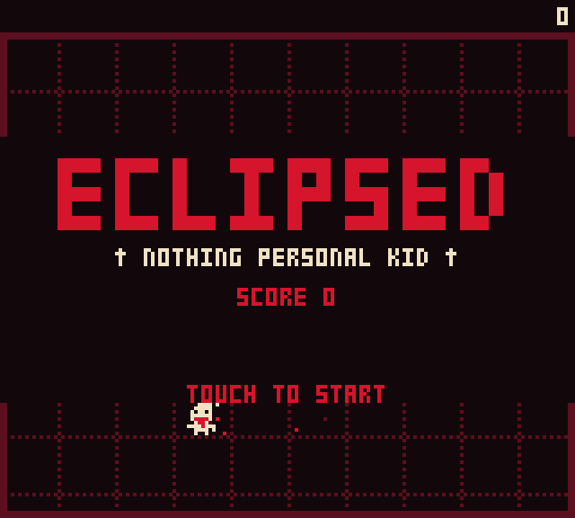 |
| 여왕이 죽으면 벽이 피를 흘린다 | 호러의 촉수 | ECLIPSED |

<details>
<summary><b>스포일러: 마지막 1분과 엔딩</b></summary>

| | | |
|:-:|:-:|:-:|
| 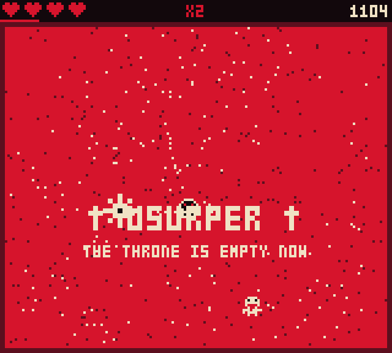 | 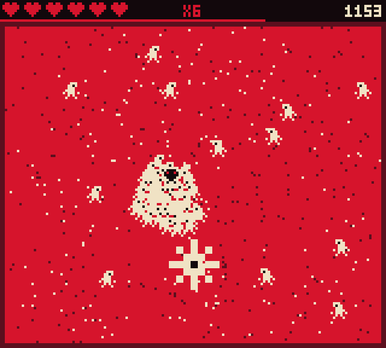 | 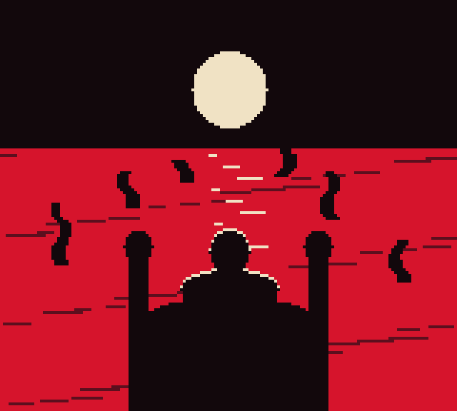 |
| 바닥이 잠긴다 | 마지막 돌진 | 왕좌 |
| 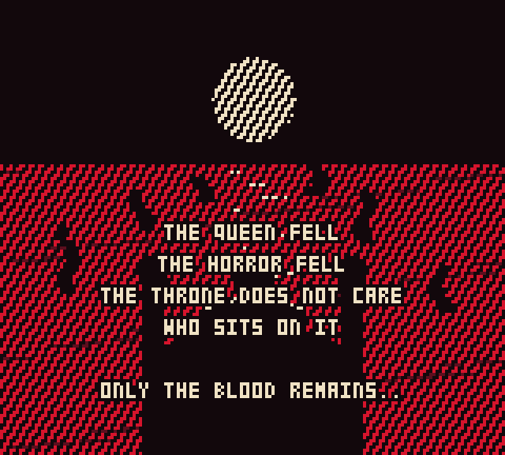 | 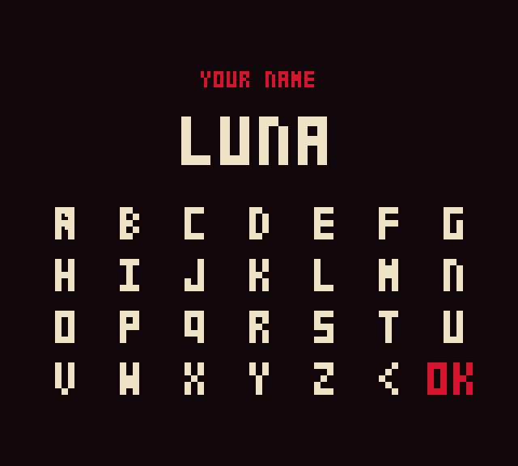 | 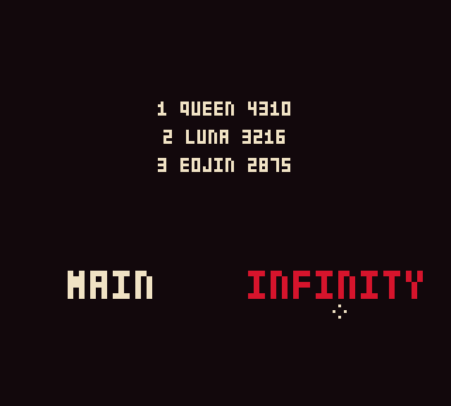 |
| 마지막 문장들 | 순위표에 올릴 이름 | MAIN 또는 INFINITY |

</details>

## 시놉시스

붉은 달 아래, 놈들은 당신을 쇠공에 묶어 죽은 자들에게 던져 넣었습니다.

당신은 대신 그 사슬을 휘둘렀습니다.

망자를 충분히 죽이면 진홍의 여왕이 내려와 묻습니다. 누가 감히 왕좌에 도전하느냐고. 여왕을 죽이면 벽이 피를 흘리기 시작하고, 게임은 당신이 무엇이 되었는지 알려줍니다. 그다음에는 왕 천 명을 삼킨 것이 빈자리를 차지하러 옵니다.

괴물을 없애러 온 게 아닙니다. 그들의 왕좌를 빼앗으러 온 겁니다. 왕좌는 누가 앉든 신경 쓰지 않습니다. 오직 피만이 남습니다.

## 플레이 방법

**당신**  은 포인터를 따라 달립니다. **쇠공**  은 당기기만 하는 사슬에 매달려 있어서, 공을 움직이려면 몸을 움직이는 수밖에 없습니다. 원을 그리며 달리면 공이 돌고, 멈추면 사슬이 늘어집니다.

- **속도가 곧 위력입니다.** 느린 공은 망자를 밀어내기만 합니다. 빠른 공은 터뜨립니다. 브루트를 잡거나 보스에게 2의 피해를 주려면 제대로 휘둘러야 합니다.
- **하트 세 개.** 망자나 침, 보스에 닿으면 하나를 잃습니다. 그 순간 주변 무리가 밀려나고 1.5초 동안 무적이 됩니다.  하트는 브루트가 떨어뜨리고 다른 망자도 가끔 떨어뜨리지만, 10초에 하나를 넘지 않습니다. 체력이 가득할 때 주우면 5점이 됩니다.
- **콤보.** 앞선 처치 후 약 1초 안에 또 잡으면 점수가 1점씩 올라갑니다. 1, 2, 3, 4…
- **피는 남습니다.** 흘린 것은 전부 바닥에 남아 밝은 빨강에서 검붉은색으로 천천히 마릅니다. 끝에 가면 바닥이 남아나지 않습니다.

### 강화

몇 마리 잡을 때마다(4, 5, 8, 13, 20… 점점 늘어납니다) 게임이 멈추고 카드 세 장이 내리꽂힙니다. 한 장을 고릅니다.

| 카드 | 횟수 | 효과 |
|---|:-:|---|
| LONGER CHAIN | 4 | 사슬이 처음 길이의 4분의 1씩 길어집니다 |
| BIGGER BALL | 2 | 공이 커지고 닿는 범위가 넓어집니다 |
| FASTER SPIN | 4 | 팽팽한 사슬이 공을 돌던 방향으로 더 밀어줍니다 |
| FASTER LEGS | 4 | 더 빨리 달립니다. 그만큼 공도 빨라집니다 |
| EXTRA HEART | 3 | 하트가 하나 늘고 전부 채워집니다 |

## 망자들

<p align="center">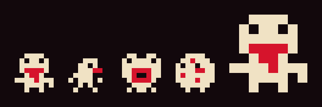</p>

망자는 벽에서 들어오고, 위험 시계가 흐를수록 구성이 나빠집니다. 보스가 방에 있는 동안에는 시계가 멈추고, 보스가 죽으면 40초 되감깁니다.

| | 이름 | 등장 | 특징 |
|:-:|---|:-:|---|
|  | **섐블러** (Shambler) | 시작 | 그냥 걸어옵니다. 잡게 될 망자의 절반이 이놈입니다. |
| 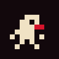 | **러너** (Runner) | 15초 | 작고, 두 배 넘게 빠릅니다. 마지막 돌진은 전부 이놈입니다. |
|  | **스피터** (Spitter) | 25초 | 거리를 두고 멈춰 서서 2초마다 세 갈래로 침을 뱉습니다. 가만히 서 있으면 맞습니다. |
|  | **블로터** (Bloater) | 30초 | 죽으면 터지면서 주변 망자를 같이 날립니다. 너무 가까이 있으면 당신도 다칩니다. |
|  | **브루트** (Brute) | 45초 | 두 배 크기. 제대로 휘두르지 않으면 공이 튕겨 나옵니다. 죽으면 하트를 남깁니다. |

모두 처음 100초에 걸쳐 1.5배까지 빨라집니다.

## 두 개의 왕좌

### 진홍의 여왕 (The Crimson Queen)

<p align="center">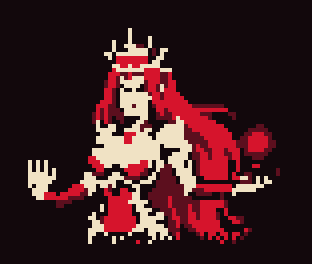</p>

500점에 나타납니다.

> WHO DARES CHALLENGE THE THRONE
> (누가 감히 왕좌에 도전하는가)

당신을 따라 떠다닙니다. 구슬에서는 불덩이 열두 개가 원형으로 퍼지는데, 쏠 때마다 각도가 조금씩 돌아갑니다. 펼친 손바닥은 당신이 선 자리를 겨누고, 선을 보여준 다음, 그 선을 따라 빔을 쏩니다. 체력이 절반 아래로 내려가면 둘 다 빨라집니다.

여왕이 죽으면 벽이 피를 흘리기 시작합니다. *† REGICIDE † NOW YOU ARE THE MONSTER* (국왕 시해. 이제 네가 괴물이다)

### 호러 (The Horror)

<p align="center">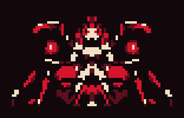</p>

여왕이 죽은 뒤 1000점에 나타납니다.

> I HAVE EATEN A THOUSAND KINGS
> (나는 왕 천 명을 삼켰다)

구슬 하나가 다섯 갈래로 탄을 쏩니다. 바닥에서는 점선 원이 당신을 쫓아오다 멈추고, 그 자리에서 촉수가 솟구친 다음, 당신 쪽으로 한 번 내리칩니다. 솟구칠 때도 아프고 내리칠 때도 아픕니다.

죽으면 바닥이 잠깁니다. *† USURPER † THE THRONE IS EMPTY NOW* (찬탈자. 이제 왕좌는 비었다)

보스는 빠른 공에 1, 제대로 휘두른 공에 2의 피해를 입습니다. 하나를 잡을 때마다 100점을 얻고 하트가 전부 채워집니다.

## 한 판의 흐름

1. **망자가 들어옵니다.** 처음엔 느립니다. 레벨이 오르고 바닥이 물들어 갑니다.
2. **500점: 진홍의 여왕.** 여왕이 나타나는 순간 바닥에 있던 것들이 전부 터집니다.
3. **벽이 피를 흘립니다.** 게임은 계속되고, 더 어려워집니다.
4. **1000점: 호러.**
5. **범람.** 세상이 3분의 1 속도로 느려지고 깜빡이는 동안 바닥이 마지막 한 칸까지 잠깁니다. 이제 당신은 죽지 않습니다.
6. **마지막 카드: BLOOD AWAKENING.** 모든 강화가 최대치, 하트 여섯 개.
7. **돌진.** 10초 동안 모든 것이 점점 더 빠르게 달려듭니다.
8. **굉음, 섬광, 암전.** 그리고 왕좌, 마지막 문장들, 집계.
9. **순위표.** 상위 3위 안에 들면 다섯 글자까지 이름을 남깁니다. 기록은 브라우저에 저장됩니다.
10. **MAIN 또는 INFINITY.** 인피니티 모드에는 보스도 끝도 없습니다. 한 번 엔딩을 본 뒤에는 타이틀 화면 맨 아랫줄에서도 시작할 수 있습니다.

끝까지 가는 데 4~5분쯤 걸립니다.

## 10킬로바이트에 넣은 방법

출품 파일은 9,999바이트입니다. 그 바이트가 어디에 쓰였는지, 거기까지 가려고 무엇을 했는지 적습니다.

### 예산

| | 바이트 |
|---|--:|
| 주석 포함 읽을 수 있는 소스 (`dist/luna-cruenta-source.html`) | 34,478 |
| 최소화 후 (terser) | 23,299 |
| **패킹 후 (Roadroller): 출품 파일** | **9,999** |

패킹된 파일은 `<script>` 태그 안에 든 ASCII 텍스트 한 줄입니다. 압축된 게임 본문이 먼저 오고, 그걸 푸는 코드가 뒤따릅니다.

| 파일의 부분 | 바이트 |
|---|--:|
| 압축된 게임 본문 (글자 하나가 6비트를 담음) | 9,327 |
| 그걸 푸는 해제 코드 | 655 |
| `<script>`와 `</script>` | 17 |

그 9,327 안에서 각 조각이 차지하는 비용입니다. 하나씩 빼고 다시 패킹해서 줄어든 만큼을 쟀습니다.

| 조각 | 소스에서의 크기 | 비용 |
|---|---|--:|
| 진홍의 여왕 | 68×56 픽셀 | 471 |
| 호러 | 34×40 픽셀, 좌우 대칭 | 240 |
| 타이틀 글씨 | 글자 9개, 각 11×28 | 192 |
| 페이지 자체 (캔버스와 CSS) | 174자 | 171 |
| 마지막 문장들 | 188자 | 113 |
| 작은 스프라이트 7개 | 각 8×8 | 103 |
| 3×5 폰트 | 글리프 40개 | 101 |
| 선율 | 96자 | 81 |
| 나머지 전부: 코드 전체와 남은 텍스트 | | 약 7,850 |

픽셀 아트를 전부 합치면 여백 포함 9,532픽셀이고 약 1,100바이트가 듭니다. 픽셀당 1비트가 조금 안 됩니다.

### 1. 작은 화면과 네 가지 색

게임은 160×144 버퍼에 그립니다. 버퍼는 픽셀마다 0부터 3까지의 숫자 하나만 담고, 프레임마다 한 번 4칸짜리 팔레트가 그걸 색으로 바꿉니다.

<p></p>

효과 대부분이 이 숫자를 갖고 부리는 잔꾀라서 비용이 거의 들지 않습니다.

- **타격 섬광**은 화면에 내보낼 때 모든 픽셀의 숫자를 뒤집습니다(0↔3, 1↔2).
- **페이드와 크레딧 뒤의 반쯤 어두운 화면**은 대각선 무늬로 픽셀을 검게 지우되, 프레임마다 조금씩 더 지웁니다. 네 가지 색에는 거쳐 갈 중간색이 없기 때문입니다.
- **엔딩의 줌아웃**은 화면으로 옮기는 그 마지막 복사에서 버퍼를 비율을 줘서 읽는 것으로 처리합니다.
- **화면 흔들림**은 CSS로 캔버스를 통째로 움직입니다.
- **바닥**은 절대 지우지 않는 두 번째 버퍼입니다. 피를 거기에 쓰면 그대로 남습니다. 이 게임의 전제 자체이면서, 구현으로도 가장 싼 방법입니다.

### 2. 그림은 글자입니다

모든 스프라이트는 픽셀 하나에 숫자 하나씩 적은 문자열로, 소스에 그대로 들어갑니다. 이 리포지토리에서는 사람이 읽고 고칠 수 있는 텍스트(`src/art`)로 두고, 빌드할 때 그 문자열로 바꿉니다.

- **브루트**는 섐블러를 두 배 크기로 그린 것입니다.
- **호러**는 좌우 대칭이라 오른쪽 절반만 저장합니다.
- 보스 스프라이트는 외따로 떨어진 점을 정리했습니다. 잡티는 비쌉니다. 패커는 주변 픽셀을 보고 다음 픽셀을 맞히는데, 노이즈는 맞힐 수가 없기 때문입니다.

### 3. 폰트 둘, 쓰는 글자만

- **3×5 폰트**에는 글리프가 40개 있습니다. 공백, 숫자, A부터 Z, 단검(†), 지우기 화살표, 마침표. 소문자도 다른 문장부호도 없습니다. 아포스트로피가 없어서 게임 속 문장 어디에도 "DOESN'T"가 나오지 않습니다.
- **타이틀 글씨**는 딱 9개입니다. L, U, N, A, C, R, E, T, 그리고 이름 끝의 키 큰 A. 다른 단어는 쓸 수 없습니다.

<p></p>

- 글자의 밝은 테두리는 저장하지 않습니다. 왼쪽 위 대각선 자리가 비어 있으면 뼈색으로, 아니면 빨강으로 찍을 뿐입니다.

### 4. 장면은 저장하지 않고 그립니다

타이틀 화면과 엔딩은 "채운 타원"과 "채운 사각형"을 수십 번 부른 결과입니다.

- **달**은 뼈색 원판과 빨간 원판을 한 픽셀 어긋나게 겹친 것입니다. 그 틈이 밝은 테두리가 됩니다.
- **달의 얼룩과 구름**은 좌표 목록이 아니라 산수 한 줄씩에서 나옵니다. 손으로 배치한 목록이 조금 더 보기 좋았지만 48바이트를 더 썼습니다.
- **죽은 나무**는 작은 함수 하나입니다. 구불구불한 가지를 하나 그리고, 그 끝에서 갈라지는 두 가지를 그리려고 자기 자신을 두 번 부릅니다. 가장 짧은 잔가지 끝에는 방울이 매달립니다.
- **엔딩**은 빛을 위한 원판 하나, 물결을 위한 선들, 보스전의 촉수 함수 여섯 번, 그리고 타원과 사각형으로 쌓은 실루엣입니다. 머리와 어깨의 빛 테두리는 달과 같은 원판 두 장 수법입니다.

### 5. 선율 하나를 세 가지로

모든 소리는 함수 하나가 만듭니다. 한 음에서 다른 음으로 미끄러지는 오실레이터이거나, 필터를 거친 노이즈입니다. 효과음 전부와 음악의 음 하나하나가 이 함수를 부르는 호출입니다.

음악은 16마디짜리 선율 하나입니다. 음표나 쉼표 하나에 글자 하나씩 96자, 그리고 베이스 근음 16개. 이걸 세 가지로 연주합니다.

- **플레이 중**에는 빠르게. 달리는 베이스 위에 드럼이 한 겹씩 들어오고 선율이 얹힙니다.
- **타이틀**에서는 걷는 빠르기로. 깊은 근음 위에 길게 끄는 화음, 옥타브로 겹친 선율.
- **엔딩**에서는 같은 편곡을 타이틀의 3분의 2쯤 되는 속도로.

그래서 타이틀 테마와 엔딩 테마에 든 비용은 선율을 다시 배치하는 세 줄뿐입니다.

### 6. 페이지

- doctype도, `<html>`·`<head>`·`<body>`도, `<title>`도, 문자 인코딩 선언도, viewport 태그도 없습니다.
- 캔버스는 flexbox 대신 짧은 CSS 선언 세 개로 가운데에 놓습니다.
- 캔버스와 CSS는 스크립트가 직접 써넣습니다. 그래야 나머지와 함께 패킹되기 때문입니다. 다만 밖에 그냥 두는 것보다 3바이트쯤 이득일 뿐이고, 실제로 줄인 건 내용을 짧게 만든 쪽입니다.

### 7. 패커, 그리고 옆을 보게 가르치기

최소화한 코드도 한참 큽니다. 그래서 [Roadroller](https://github.com/lifthrasiir/roadroller)로 패킹합니다. Roadroller는 맞히기로 압축합니다. 글자마다 "앞의 두 글자", "세 칸 앞의 글자" 같은 몇 가지 *문맥*을 보고 다음 글자를 예측하고, 잘 맞힐수록 그 글자에 드는 비트가 줄어듭니다.

코드에는 이상적입니다. 그림에는 사각지대가 있습니다. 스프라이트를 세로줄 순서로 적으면 긴 숫자 한 줄이 되는데, 어떤 픽셀의 **위** 픽셀은 바로 앞 글자라서 패커가 봅니다. 하지만 **왼쪽** 픽셀은 세로줄 하나만큼 앞에 있습니다. 여왕이라면 56글자 앞입니다. Roadroller의 자체 튜너는 직전 9글자로 만든 문맥만 시도하고, 애초에 30글자쯤보다 멀리는 볼 수 없습니다. 결국 모든 스프라이트를 폭이 1픽셀인 그림처럼 압축하고 있었던 셈입니다.

두 가지로 고쳤습니다.

1. **스프라이트를 28줄 높이의 띠로 나눠 배치합니다.** 여왕은 띠 두 개이고, 호러와 타이틀 글자는 같은 높이에 맞게 여백을 채웁니다. 이제 어느 그림의 어느 픽셀이든 왼쪽 픽셀은 정확히 28글자 앞에 있습니다.
2. **패커에게 거기를 보라고 알려줍니다.** 빌드에 패커 설정을 찾는 자체 탐색이 들어 있습니다. 27, 28, 29글자 앞을 보는 문맥도 고를 수 있고, 시도할 때마다 실제 파일 크기로 점수를 매깁니다. (Roadroller의 자체 튜너는 파일을 나중에 zip으로 묶는다고 가정한 추정치로 점수를 매기는데, 이 출품작의 크기는 그렇게 재지 않습니다.) 탐색은 그런 문맥 두 개에 정착했습니다. "왼쪽 픽셀", 그리고 "위 픽셀과 앞 세로줄에서 그 옆에 붙은 세 픽셀".

바로 이 코드를 놓고 잰 효과입니다.

| 패커 설정 | 바이트 |
|---|--:|
| Roadroller 기본 설정 | 10,462 |
| Roadroller 자체 튜너, 가장 꼼꼼한 단계 | 10,255 |
| 이 빌드의 탐색이 찾은 설정에서 먼 거리 문맥 두 개만 뺀 것 | 10,240 |
| **이 빌드의 탐색이 찾은 설정** | **9,999** |

비교 삼아 적으면, 같은 최소화 코드는 gzip으로 9,113바이트, Brotli로 7,981바이트가 됩니다. 하지만 그 둘은 바이너리이고, 페이지가 바이너리에서 스스로 풀려나려면 해제 코드와 텍스트 인코딩에 그 차이를 다 써야 합니다. 여기의 패킹된 텍스트는 9,327글자에 약 7,000바이트어치 정보를 담고 있습니다.

### 8. 그럴듯했지만 아니었던 것들

전부 실제로 해보고 쟀는데, 하나같이 파일이 더 커졌습니다.

- **각 세로줄을 앞 세로줄과의 차이로 저장하기.** 패커가 이미 써먹고 있던 세로 방향의 연속을 깨뜨립니다. 여왕이 626바이트에서 765바이트가 됐습니다.
- **런 렝스 인코딩.** 시도한 것 중 가장 나은 형태가 여왕 기준 634바이트였고, 그냥 숫자로 적은 쪽은 630바이트였습니다. 나머지는 더 나빴습니다.
- **글자 하나에 픽셀 두 개.** 634가 660이 됐습니다.
- **작은 스프라이트는 16진수로, 폰트는 36진수로.** 둘 다 오랫동안 게임에 들어 있던 방식입니다. 픽셀 하나에 숫자 하나, 비트 하나에 글자 하나로 되돌렸더니 최소화 코드는 600자쯤 길어졌고 파일은 70바이트쯤 줄었습니다.

네 경우의 교훈은 같습니다. 이 패커에서는 가장 짧게 적은 것이 아니라 가장 예측하기 쉽게 적은 것이 가장 작습니다.

### 9. 포기한 것들

타이틀 화면은 마지막에 들어간 큰 덩어리였고 550바이트쯤 들었습니다. 그 값과 그 뒤에 추가한 것들의 값을 치르느라, 게임에 있던 것들을 덜어냈습니다.

- 한국어/영어 전환. 만들었다가 나중에 뺐습니다.
- 음악에서: 솔로 구간, 리드의 에코, 아르페지오.
- 피 위에 찍히던 발자국.
- 세상을 얼마나 물들였는지 알려주던 사망 화면의 한 줄, 그리고 그 줄에서만 쓰던 `%` 글리프.
- 마지막 집계의 농담 몇 줄.
- 사라지기 직전 깜빡이던 하트.
- viewport 태그. 이제 폰에서는 데스크톱 폭으로 배치된 뒤 화면에 맞게 줄어드는데, 알고 보니 그쪽이 화면에 더 크게 나옵니다.
- 엔딩의 사악한 웃음소리. 오실레이터 몇 바이트짜리였고, 딱 그렇게 들렸습니다.

### 10. 어느 쪽 10킬로바이트인가

잼 규칙에는 "10 KB"라고만 적혀 있고, 그게 10,000바이트인지 10,240바이트인지는 나와 있지 않습니다. 이 출품작은 둘 다 넘지 않습니다. 빌드할 때 각각까지 남은 바이트를 출력합니다.

## 빌드

[Node.js](https://nodejs.org)가 필요합니다. 쓰는 도구 두 개의 버전을 고정해 두었기 때문에, 빌드할 때마다 같은 9,999바이트가 나옵니다.

```
npm install
npm run build
```

| 명령 | 하는 일 |
|---|---|
| `npm run build` | `luna-cruenta.html`(출품 파일)과, `dist/`에 읽을 수 있는 소스와 디버그 빌드를 만듭니다 |
| `npm run search` | 먼저 패커 설정 탐색을 1,500단계 돌리고, 더 나은 걸 찾으면 저장합니다. 코드를 고친 뒤에 돌려볼 만합니다. |
| `npm run test-build` | 여왕이 6점, 호러가 26점에 나오는 `dist/luna-cruenta-test.html`을 만듭니다 |

### 디버그 빌드

`dist/luna-cruenta-debug.html`은 읽을 수 있는 소스에 키 네 개를 더한 것입니다. 게임을 시작한 뒤에 누릅니다.

| 키 | |
|:-:|---|
| `1` | 여왕이 한 대만 맞으면 죽는 상태로 등장 |
| `2` | 호러가 한 대만 맞으면 죽는 상태로 등장 |
| `3` | 엔딩을 지금 시작 |
| `4` | 크레딧 도중: 크레딧 끝으로 건너뛰기 |

## 폴더 구조

```
luna-cruenta.html            출품 파일: 파일 하나, 9,999바이트
index.html                   출품 파일로 넘겨주는 리다이렉트. GitHub Pages 주소로 게임이 열리게 하는 용도
README.md                    이 문서 (한국어 + English)
package.json                 terser와 roadroller 버전 고정
src/
  game.html                  게임 본체. 주석이 달린 읽을 수 있는 소스이고, 데이터 자리는 비워 둠
  music.js                   시퀀서와 선율
  debug.js                   단계 건너뛰기 키 (디버그 빌드 전용)
  art/
    sprites.js               8x8 스프라이트 7개와 3x5 폰트
    queen.txt                진홍의 여왕, 텍스트로
    horror.txt               호러의 오른쪽 절반, 텍스트로
    title-letters.txt        타이틀 글자 9개, 텍스트로
tools/
  build.js                   채우기 -> 최소화 -> 패킹, 그리고 패커 설정 탐색
  data.js                    src/art를 게임이 들고 다니는 문자열로 변환
  packer-settings.json       탐색이 찾은 설정
dist/
  luna-cruenta-source.html   게임 전체를 읽을 수 있는 파일 하나로
  luna-cruenta-debug.html    위와 같고, 디버그 키 포함
docs/                        이 README에 쓰인 이미지
```

출품 파일 이름이 `index.html`이 아닌 것은 잼 규칙이 index 파일을 허용하지 않기 때문입니다. 여기 있는 `index.html`은 출품 파일로 넘겨주는 리다이렉트일 뿐입니다.

## 참고

- 데스크톱 크로미움과 그 폰 에뮬레이션에서 확인했습니다. 다른 브라우저와 실제 폰에서는 확인하지 못했습니다.
- 순위표와 "엔딩을 봤음" 표시는 브라우저의 `localStorage`에 `pulpR`, `pulpW`라는 키로 저장됩니다. PULP는 이 게임의 개발 중 가제였습니다.
- 패킹된 파일은 `eval`로 스스로를 풉니다. 엄격한 콘텐츠 보안 정책(CSP)이 걸린 곳에서는 막힙니다.

## 크레딧

- 패킹: Kang Seonghoon의 [Roadroller](https://github.com/lifthrasiir/roadroller), 최소화: [terser](https://terser.org).
- itch.io [10 Kilobytes Jam](https://itch.io/jam/10-kilobytes-jam-) 출품작.

---

<a id="english"></a>

<details>
<summary><b>English</b> (click to open)</summary>

<p align="right"><a href="#luna-cruenta">한국어 ↑</a></p>

**A splatter arcade game in four colours, in one 9,999-byte HTML file.**
Made for the [10 Kilobytes Jam](https://itch.io/jam/10-kilobytes-jam-).

You are chained to a spiked iron ball. Swing it. Whatever gets spilled stays on the floor.

There are no image files, no font files, no audio files and no libraries. The sprites, two bosses, two fonts, the title screen, the ending, the music and the sound effects are all inside that one file.

## Play

Download [`luna-cruenta.html`](luna-cruenta.html) and open it in a browser. It needs nothing else.

<!-- TODO: add the itch.io page link here once the entry is uploaded -->

- **Mouse:** you run after the pointer.
- **Touch:** drag anywhere. The target moves one and a half times as far as your finger, so your hand never covers you.
- There are no keys and no buttons. A click or tap starts a run, picks an upgrade card, and retries.

A browser will not play sound before the first click or tap. If the title screen is silent, the first touch only starts the music and the second starts the run.

## Screenshots

<p align="center">
  
</p>

| | | |
|:-:|:-:|:-:|
|  |  |  |
| Every kind of the dead at once | Level up: pick one card | The Crimson Queen's beam |
|  |  |  |
| The walls bleed once she is dead | The Horror's tentacle | Eclipsed |

<details>
<summary><b>Spoilers: the last minute and the ending</b></summary>

| | | |
|:-:|:-:|:-:|
|  |  |  |
| The floor floods | The last rush | The throne |
|  |  |  |
| The closing words | A name for the board | Main, or infinity |

</details>

## Synopsis

Under a blood moon, they chained you to an iron ball and threw you to the dead.

You swung the chain instead.

Kill enough of them and the Crimson Queen comes to ask who dares challenge her throne. Kill her, and the walls start to bleed, and the game tells you what you have become. Then the thing that has eaten a thousand kings comes for the empty seat.

You are not here to rid the world of monsters. You are here to take their throne. The throne does not care who sits on it. Only the blood remains.

## How to play

**You**  run after the pointer. **The ball**  hangs on a chain that can only pull, so the only way to move it is to move yourself: run in circles and it swings, stop and it falls slack.

- **Speed is damage.** A slow ball only shoves the dead aside. A fast one bursts them. A brute, or a boss's second point of damage, needs a full swing.
- **Three hearts.** Touching the dead, their spit, or a boss costs one, shoves the crowd back and leaves you untouchable for a second and a half.  Brutes drop hearts, and now and then so does anything else, but never more than one every ten seconds. Pick one up at full health and it is worth 5 points instead.
- **Combos.** Each kill within about a second of the last is worth one point more than the one before: 1, 2, 3, 4…
- **Blood stays.** Everything spilled stays on the floor and slowly dries from bright red to dark. By the end there is no floor left.

### Upgrades

Every few kills (4, then 5, 8, 13, 20… more each time) the game stops and three cards slam down. Pick one.

| Card | Times | What it does |
|---|:-:|---|
| LONGER CHAIN | 4 | The chain grows by a quarter of its first length each time |
| BIGGER BALL | 2 | A larger ball with a longer reach |
| FASTER SPIN | 4 | A taut chain pushes the ball further the way it is already turning |
| FASTER LEGS | 4 | You run faster, so everything swings faster |
| EXTRA HEART | 3 | One more heart, and all of them refilled |

## The dead

<p align="center"></p>

They come in from the walls, and the mix gets worse as the danger clock runs. The clock stops while a boss is in the room, and a boss's death winds it back forty seconds.

| | Name | From | What it does |
|:-:|---|:-:|---|
|  | **Shambler** | start | Walks at you. Half of everything you will ever kill. |
|  | **Runner** | 15 s | Small and more than twice as fast. The last rush is nothing but these. |
|  | **Spitter** | 25 s | Stops at a distance and spits a spread of three every two seconds, so standing still gets you hit. |
|  | **Bloater** | 30 s | Bursts when killed and takes its neighbours with it. And you, if you are standing too close. |
|  | **Brute** | 45 s | Twice the size. Anything less than a full swing just thuds off it. Leaves a heart when it dies. |

All of them speed up over the first hundred seconds, to one and a half times where they started.

## The two thrones

### The Crimson Queen

<p align="center"></p>

Arrives at 500 points.

> WHO DARES CHALLENGE THE THRONE

She drifts after you. Her orb throws a ring of twelve fireballs, turned a little each time. Her open hand aims at where you stand, shows the line, then fires a beam along it. Below half health she does both faster.

When she dies the walls begin to bleed: *† REGICIDE † NOW YOU ARE THE MONSTER*.

### The Horror

<p align="center"></p>

Arrives at 1000 points, once the queen is dead.

> I HAVE EATEN A THOUSAND KINGS

One of its orbs spits a fan of five at you. On the floor, a dotted ring hunts you, stops, and a tentacle bursts up through it, then slaps down once toward where you are. The burst hurts, and so does the slap.

When it dies the floor floods: *† USURPER † THE THRONE IS EMPTY NOW*.

A boss takes one point of damage from a fast ball and two from a full swing. Each death is worth 100 points and refills your hearts.

## A run, start to finish

1. **The dead come in.** Slowly at first. You level up, and the floor fills.
2. **500 points: the Crimson Queen.** Everything on the floor bursts as she arrives.
3. **The walls bleed.** Play goes on, harder.
4. **1000 points: the Horror.**
5. **The flood.** The world runs at a third of its speed and flickers while the floor fills to the last tile. Nothing can kill you any more.
6. **One last card: BLOOD AWAKENING.** Every upgrade at its maximum, six hearts.
7. **The rush.** Ten seconds of everything running at you, faster and faster.
8. **A roar, a flash, the dark.** Then the throne, the closing words, and the tally.
9. **The board.** A score in the best three gets a name of up to five letters, kept in the browser.
10. **MAIN or INFINITY.** Infinity mode has no bosses and no end, and from then on it can also be started from the bottom line of the title screen.

A full run takes about four to five minutes.

## How it fits in 10 kilobytes

The entry is 9,999 bytes. This is where they go, and what was done to get there.

### The budget

| | Bytes |
|---|--:|
| Readable source, with comments (`dist/luna-cruenta-source.html`) | 34,478 |
| After minifying (terser) | 23,299 |
| **After packing (Roadroller): the entry** | **9,999** |

The packed file is a single line of plain ASCII inside a `<script>` tag: the game as packed text, then the code that unpacks it.

| Part of the file | Bytes |
|---|--:|
| The game, as packed text (each character carries 6 bits) | 9,327 |
| The unpacker that reads it | 655 |
| `<script>` and `</script>` | 17 |

And this is what some of the pieces cost inside those 9,327, measured by taking each one out and packing again:

| Piece | In the source | Costs |
|---|---|--:|
| The Crimson Queen | 68×56 pixels | 471 |
| The Horror | 34×40 pixels, mirrored | 240 |
| Title lettering | nine letters, 11×28 each | 192 |
| The page itself (canvas and CSS) | 174 characters | 171 |
| The closing words | 188 characters | 113 |
| Seven small sprites | 8×8 each | 103 |
| The 3×5 font | 40 glyphs | 101 |
| The tune | 96 characters | 81 |
| Everything else: all the code and the remaining text | | about 7,850 |

All the pixel art together, padding included, is 9,532 stored pixels and costs about 1,100 bytes: a little under one bit a pixel.

### 1. A tiny screen and four colours

The game draws into a 160×144 buffer that holds one number from 0 to 3 for each pixel, and a four-entry palette turns that into colour once a frame.

<p></p>

Most of the effects are tricks on those numbers, so they cost almost nothing:

- **The hit flash** flips every pixel's number (0↔3, 1↔2) on the way to the screen.
- **Fades and the half-dark behind the credits** blacken pixels in a diagonal pattern, a few more each frame. Four colours have no in-between shades to fade through.
- **The zoom out at the end** is done in the same final copy to the screen, by reading the buffer at a scale.
- **Screen shake** moves the whole canvas with CSS.
- **The floor** is a second buffer that is never cleared. Blood is written into it and stays, which is the whole premise of the game and also the cheapest possible way to do it.

### 2. Pictures are text

Every sprite is a string of digits, one digit a pixel, typed straight into the source. In this repository they are kept as text you can read and edit (`src/art`), and the build turns them into those strings.

- The **brute** is the shambler drawn at twice the size.
- The **Horror** is symmetrical, so only its right half is stored.
- The boss sprites were cleaned of stray single pixels. Speckle is expensive: the packer guesses each pixel from its neighbours, and noise cannot be guessed.

### 3. Two fonts, and only the letters that are used

- The **3×5 font** has forty glyphs: a space, the digits, A to Z, a dagger, a delete arrow and a full stop. There is no lower case and no other punctuation. There is no apostrophe, which is why nothing in the game says "DOESN'T".
- The **title lettering** has exactly nine: L, U, N, A, C, R, E, T and the tall A that ends the name. It cannot write anything else.

<p></p>

- The bright edge on those letters is not stored. A pixel is drawn in bone if the pixel up and to the left of it is empty, and in red otherwise.

### 4. Scenes are drawn, not stored

The title screen and the ending are a few dozen calls to "filled ellipse" and "filled box".

- **The moon** is two discs, one bone and one red, a pixel apart. That is its bright rim.
- **The moon's seas and the clouds** come out of a line of arithmetic each, not from a list of positions. A hand-placed list looked a little better and cost 48 bytes more.
- **The dead tree** is one small function that draws a wobbling limb and then calls itself twice for the two limbs that fork from its end. The shortest twigs end in a drip.
- **The ending** is a disc for the light, lines for the water, six uses of the tentacle function from the boss fight, and a silhouette built from ellipses and boxes. The rim of light on the head and shoulders is the same two-disc trick as the moon.

### 5. One tune, three ways

All sound is made by one function: either an oscillator sliding from one pitch to another, or noise through a filter. Every effect and every note of the music is a call to it.

The music is one tune of sixteen bars: 96 characters, one for each note or rest, plus sixteen bass roots. It is played three ways:

- **in play**, fast, with a galloping bass, drums that come in layer by layer, and the tune on top;
- **on the title**, at a walking pace, as held chords over a deep root with the tune in octaves;
- **at the ending**, in that same arrangement at about two thirds of the title's speed.

So the title theme and the ending theme cost only the three lines that rearrange the tune.

### 6. The page

- No doctype, no `<html>`, `<head>` or `<body>`, no `<title>`, no character set, no viewport tag.
- The canvas is centred with three short CSS declarations instead of a flexbox.
- The canvas and its CSS are written by the script itself, so they are packed along with everything else. That gains only about three bytes over leaving them outside. The real saving was in making them short.

### 7. The packer, and teaching it to look sideways

Minified code is still far too big, so the file is packed with [Roadroller](https://github.com/lifthrasiir/roadroller). It works by guessing: for every character it predicts what comes next from a handful of *contexts*, such as "the previous two characters" or "the character three back", and the better the guess, the fewer bits that character costs.

For code that is ideal. For a picture it has a blind spot. A sprite written out column by column is one long line of digits, and the pixel **above** any pixel is the previous character, which the packer sees. But the pixel **to the left** is a whole column back: 56 characters, for the queen. Roadroller's own tuner only tries contexts made of the last nine characters, and nothing can reach back further than about thirty. So it was packing every sprite as if it were one pixel wide.

Two things fixed that:

1. **The sprites are laid out in strips 28 rows tall.** The queen is two strips; the Horror and the title letters are padded to fit the same height. Now the pixel to the left of any pixel, in any picture, is exactly 28 characters back.
2. **The packer is told to look there.** The build has its own search over packer settings, which may pick contexts 27, 28 and 29 characters back, and which scores each try by the real size of the file. (Roadroller's own tuner scores by an estimate that assumes the file will be zipped afterwards, which is not how this entry is measured.) It settled on two such contexts: "the pixel to the left", and "the pixel above together with the three beside it in the column before".

What that was worth, on this exact code:

| Packer settings | Bytes |
|---|--:|
| Roadroller, default settings | 10,462 |
| Roadroller, its own tuner at its most thorough | 10,255 |
| Settings from this build's search, without the two long-reach contexts | 10,240 |
| **Settings from this build's search** | **9,999** |

For scale: the same minified code comes to 9,113 bytes through gzip and 7,981 through Brotli, but those are binary, and a page cannot open itself from binary without spending the difference on a decoder and on encoding the data as text. The packed text here carries about 7,000 bytes of information in its 9,327 characters.

### 8. Things that looked clever and were not

Each of these was tried and measured, and each made the file bigger:

- **Storing each column as its difference from the column before.** It destroys the vertical runs the packer was already using. The queen went from 626 bytes to 765.
- **Run-length encoding.** The best form tried came to 634 bytes for the queen against 630 for plain digits, and the others were worse.
- **Two pixels to a character.** 634 became 660.
- **Hex for the small sprites, base 36 for the font.** Both were in the game for a long time. Going back to one digit a pixel and one character a bit made the minified code about 600 characters longer and the file about 70 bytes smaller.

The lesson in all four: for this packer, the most predictable way to write something is the smallest, not the shortest.

### 9. What had to go

The title screen was the last big thing added, and it cost about 550 bytes. Paying for it, and for other late additions, meant losing things that had been in the game:

- A Korean and English toggle, which was built and later taken out.
- In the music: a solo section, an echo on the lead, and an arpeggio.
- Footprints in the blood.
- A line on the death screen that said how much of the world you had painted, and the `%` glyph that only it used.
- Some joke lines in the final tally.
- Hearts blinking before they vanish.
- The viewport tag. On a phone the game now lays out at desktop width and is scaled to fit, which turned out to make it larger on the screen.
- An evil laugh in the ending. It was a few bytes of oscillator and sounded like it.

### 10. Which ten kilobytes?

The jam says "10 KB" and does not say whether that is 10,000 bytes or 10,240. This entry is under both. The build prints the distance to each.

## Building

Requires [Node.js](https://nodejs.org). The two tools it uses are pinned to exact versions, so the build gives the same 9,999 bytes every time.

```
npm install
npm run build
```

| Command | What it does |
|---|---|
| `npm run build` | Writes `luna-cruenta.html` (the entry) and, in `dist/`, the readable source and the debug build |
| `npm run search` | Runs 1,500 steps of the packer-settings search first and keeps anything better it finds. Worth doing after changing the code. |
| `npm run test-build` | Writes `dist/luna-cruenta-test.html`, where the queen arrives at 6 points and the Horror at 26 |

### The debug build

`dist/luna-cruenta-debug.html` is the readable source plus four keys. Start a run, then:

| Key | |
|:-:|---|
| `1` | The queen arrives, one hit from death |
| `2` | The Horror arrives, one hit from death |
| `3` | The ending starts now |
| `4` | During the credits: jump to their end |

## Repository layout

```
luna-cruenta.html            the jam entry: one file, 9,999 bytes
index.html                   a redirect to the entry, so the GitHub Pages address opens the game
README.md                    this file (Korean, then English)
package.json                 pins terser and roadroller
src/
  game.html                  the game, readable and commented, with placeholders for its data
  music.js                   the sequencer and the tune
  debug.js                   the phase-skip keys (debug build only)
  art/
    sprites.js               the seven 8x8 sprites and the 3x5 font
    queen.txt                the Crimson Queen, as text
    horror.txt               the right half of the Horror, as text
    title-letters.txt        the nine title letters, as text
tools/
  build.js                   fill -> minify -> pack, and the packer-settings search
  data.js                    turns src/art into the strings the game carries
  packer-settings.json       what the search found
dist/
  luna-cruenta-source.html   the whole game as one readable file
  luna-cruenta-debug.html    the same, with the debug keys
docs/                        the images in this README
```

The entry is not called `index.html` because the jam's rules do not allow index files. The `index.html` here is only a redirect to it.

## Notes

- Tested in Chromium on the desktop and in its phone emulation. Other browsers and real phones have not been checked.
- The board and the "finished" flag are kept in the browser's `localStorage`, under the keys `pulpR` and `pulpW`. PULP was the game's working title.
- The packed file unpacks itself with `eval`, which a strict content security policy would block.

## Credits

- Packed with [Roadroller](https://github.com/lifthrasiir/roadroller) by Kang Seonghoon, minified with [terser](https://terser.org).
- Made for the [10 Kilobytes Jam](https://itch.io/jam/10-kilobytes-jam-) on itch.io.

</details>
